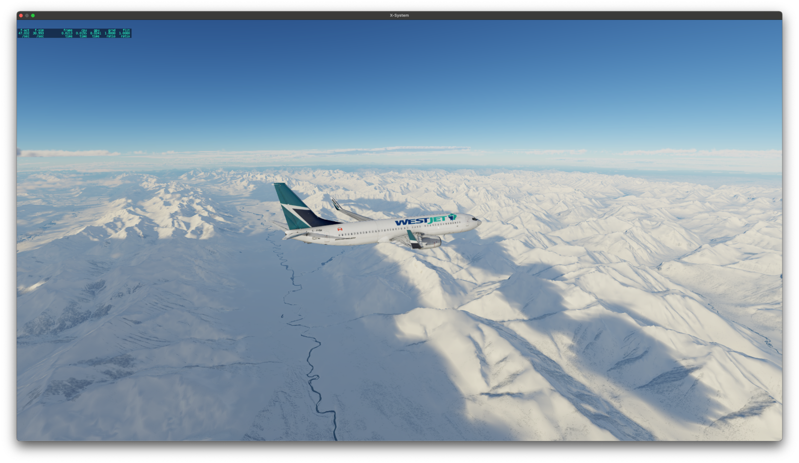
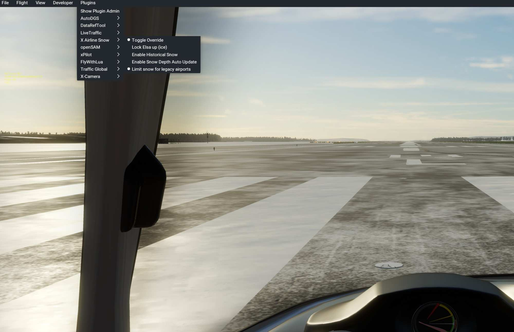

# xa-snow

Accumulated snow for X-Plane 12 created by https://github.com/zodiac1214 .

The plugin downloads "Accumulated Snow Depth" information from NOAA and depicts it in X-Plane.

Download the latest (non-beta-)release here:   https://github.com/hotbso/xa-snow/releases/latest

You can see all releases including betas here: https://github.com/hotbso/xa-snow/releases

Support Discord: https://discord.gg/dN9gvFdfAZ

### Installation
Just unpack the zip in your <X Plane>/Resources/plugins directory.

After you've installed it once skunkcrafts updater will take care.
Be sure you select the right channel PROD or BETA.

Download link for skunkcrafts updater:

https://forums.x-plane.org/index.php?/forums/topic/292710-skunkcrafts-updater-standalone-client/

### Usage
Operation is fully automatic. Nevertheless there are some options to tailor your experience:

**Toggle Override**\
xa-snow normally does not download snow data when you use "Manual Weather" in X-Plane in order to not ruin your summer scenery in the
simulator when it's actually winter outside.\
If you use ASXP you must have "Manual Weather" enabled so setting "Override" mode overrides the default behaviour and *does download snow data*.

**Lock Elsa Up**\
Lock Elsa up to reduce ice on runways and taxiways.

**Enable Historical Snow**\
As default xa-snow downloads the snow depth for the current wall clock time. \
We are trying to keep an archive of the 365 days of snow data although there may be gaps and delays. When you enable this option xa-snow
tries to download snow data of the data and time you've set up **before starting the flight**.\
This may work for you or not.

**Enable Snow Depth Auto Update**\
When enabled during a longer a flight xa-snow updates snow depth data. As downloading and (one-time) preprocessing of snow data is quite resource heavy use this option with care.\
As this may lead to stability issues the option may go away in future updates.

**Limit snow for legacy airports**\
Legacy (= mostly XP11) sceneries do not feature weather aware textures and show way to much snow and therefore make runways and taxiways unusable.\
Enabling this option smoothly reduces snow depth when you approach such an airport to a limit which make runways and taxiways visible and usable.

## Credits
zodiac1214 for creating the plugin https://github.com/zodiac1214 \
randy408 for providing libspng https://github.com/randy408/libspng, see LICENSE-libspng\
go to C++ conversion with help of https://www.codeconvert.ai/golang-to-c++-converter

